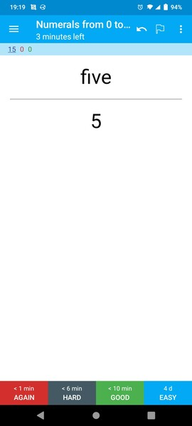

# Multilingual Numeral Flashcards: Anki flashcards for learning numerals from other languages

This is a set of flashcard files ('decks') for numerals from other languages, which can be imported into the Anki flashcard program for further review. Also included is the Python script used to generate the lists of numerals for importing into Anki.

Anki is available on Windows, Linux, Mac and Android and can be downloaded from [their website](https://apps.ankiweb.net/).

Currently, the following languages are fully implemented:

* Chinese (hanzi)
* Chinese (Mandarin, pinyin)
* English
* Finnish
* French
* Georgian
* German
* Turkish
* Vietnamese

These languages are currently in development:

* N/A

## Screenshots of generated number flashcards

### English

 

### Mandarin

 

### German

 

 

### Vietnamese

 

 

## TODOs

* Create num generator for Cantonese, Japanese, Korean, Malay/Indonesian, Thai, Dutch, Irish, Italian, Portuguese, Russian, Spanish, other widely studied languages
* Create num generator for Hungarian, Basque!
